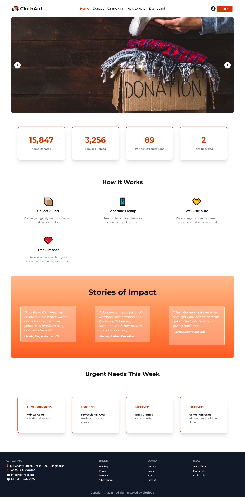
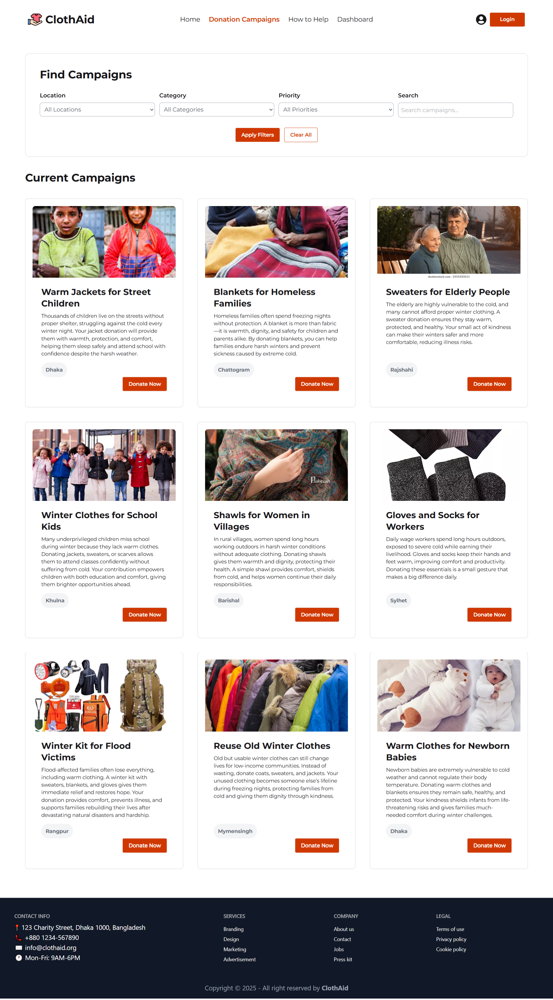

# ClothAid 🌟

**ClothAid** is a web application designed to simplify clothing donations, connecting donors with people in need efficiently. The platform promotes sustainability, social responsibility, and community support by digitizing the donation process.

## 🚀 Features

- **User Authentication**: Secure registration and login with Firebase Authentication.
- **Donation Management**: Add, manage, and track clothing donations with details like type, quantity, and condition.
- **Search & Filter Donations**: Easily find specific items or donation needs.
- **Responsive Design**: Works seamlessly on mobile, tablet, and desktop devices.
- **Admin Dashboard**: Monitor users, donations, and platform activity efficiently.

## 🛠 Technologies Used

- **Frontend**: React.js, Vite
- **Styling**: Tailwind CSS
- **Icons**: Lucide React
- **Backend**: Firebase Authentication

## 🌍 Live Demo

Check out the live project here: [ClothAid Web App](https://clothaid-c1061.web.app)

## 📂 Project Screenshot

